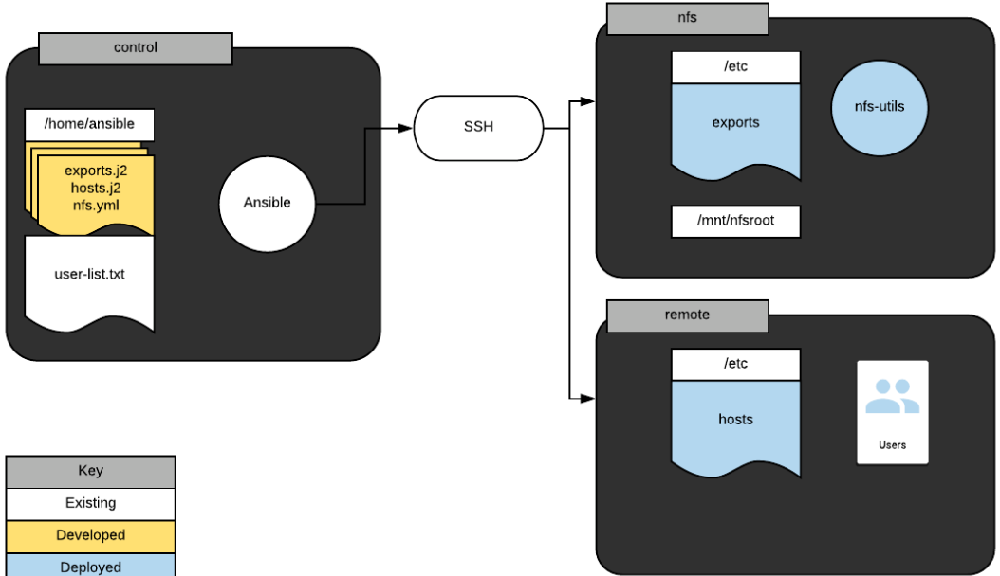

## _This Playbook does the following_

### on nfs

- Make sure nfs-utils is installed.
- Configure /etc/exports via an Ansible template stored in /exports.j2. Deploy the template so that /mnt/nfsroot is exported with _read_ and _write_ to all hosts.
- A handler runs the command _exportfs -a_ if the file /etc/exports is modified in a playbook task.

### on remote

- Configure /etc/hosts from a template file stored on control at /etc.hosts.j2 with the following entries:
  127.0.0.1 localhost {{ ansible_hostname }}
  {{ nfs_ip }} {{ nfs_hostname }}
  > _Note: variables _{{ nfs_ip }}_ and _{{ nfs_hostname }}\* are populated using magic variables in playbook.
- Create users from file stored on control at /home/ansible/user-list.txt only if the remote host has the file /opt/user-agreement.txt.
